# 你好，我是一百 👋

<a href="https://github.com/bankskurtzyulma843-hash/bankskurtzyulma843-hash/blob/main/PROJECTS.md"><picture><source media="(prefers-color-scheme: dark)" srcset="assets/v3/portfolio-launch-dark.svg"></picture></a>

点击上方终端，探索我的产品实践 · 一百的项目索引

我是一名 **AI 产品经理**，关注从需求分析、原型验证到 AI 应用落地的完整过程。\
目前通过互动叙事产品、产品架构拆解与交互实验，积累 AI 产品实践。\
希望把 AI 能力做成真正有人使用的产品。

🌐 [在线体验](https://bankskurtzyulma843-hash.github.io/blueyard-galaxy/) · 🧩 [开源 Skill](https://github.com/bankskurtzyulma843-hash/-/tree/main/product-architecture-teardown) · 📂 [项目索引](./PROJECTS.md)

---

## ⭐ 精选项目

围绕具体场景，做产品原型、交互实验和可复用的分析方法。

<!-- PROJECTS:START -->

  <a href="https://github.com/bankskurtzyulma843-hash/zhihu-life-book"><picture><source media="(prefers-color-scheme: dark)" srcset="assets/v3/nanmenwai-dark.svg"></picture></a>
  <a href="https://github.com/bankskurtzyulma843-hash/blueyard-galaxy"><picture><source media="(prefers-color-scheme: dark)" srcset="assets/v3/life-book-dark.svg"></picture></a>

  <a href="https://github.com/bankskurtzyulma843-hash/-/tree/main/product-architecture-teardown"><picture><source media="(prefers-color-scheme: dark)" srcset="assets/v3/teardown-dark.svg"></picture></a>

[查看全部项目 →](./PROJECTS.md) · [体验人生之书 →](https://bankskurtzyulma843-hash.github.io/blueyard-galaxy/)

南门外为本地原型，真实模型调用待验证。人生之书基于 BlueYard 场景扩展，原始设计与实现来自 Unseen Studio；详见项目文档。
<!-- PROJECTS:END -->

---

## ✍️ 写作与记录

在项目文档中，记录 **AI 产品、交互原型与产品拆解** 的方法和实践。\
以下是目前整理的项目记录与说明。

- [南门外：模型扩写、本地规则与失败回退](./PROJECTS.md#01--南门外)
- [产品架构拆解：从真实任务到可核查的证据](./PROJECTS.md#02--产品架构拆解)
- [人生之书：情景选择、记忆记录与交互探索](./PROJECTS.md#03--人生之书--大学篇)

[查看全部项目记录 →](./PROJECTS.md) · [在线体验 →](https://bankskurtzyulma843-hash.github.io/blueyard-galaxy/)

---

## 关于我

- AI 产品经理
- 正在实践产品原型与 AI 应用
- 探索模型扩写与确定性规则的协作
- 整理可复用的产品分析工作流
- 通过项目文档记录关键取舍与实践过程

`构建` 把想法做成原型 · `验证` 用具体任务检验 · `交付` 整理可运行的作品 · `学习` 根据反馈持续改进

保持好奇，持续实践。

<!-- Layout reference: https://github.com/17lijunyi/17lijunyi -->
