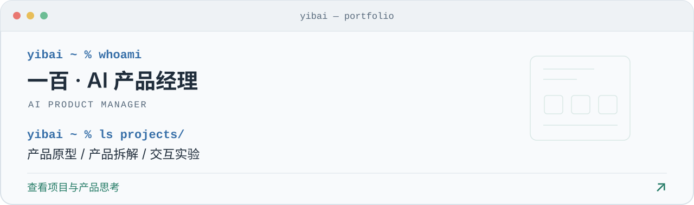
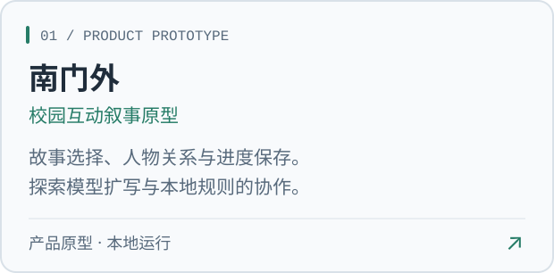
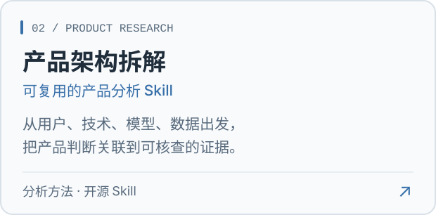
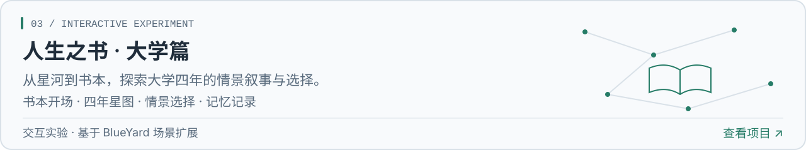

# 你好，我是一百 👋

<a href="https://github.com/bankskurtzyulma843-hash/bankskurtzyulma843-hash/blob/main/PROJECTS.md">
  <picture>
    <source media="(prefers-color-scheme: dark)" srcset="assets/v2/terminal-dark.svg">
    
  </picture>
</a>

我是一名 **AI 产品经理**。这里记录我的产品原型、产品拆解与交互实验。

[项目索引](./PROJECTS.md) · [在线体验](https://bankskurtzyulma843-hash.github.io/blueyard-galaxy/) · [开源 Skill](https://github.com/bankskurtzyulma843-hash/-/tree/main/product-architecture-teardown)

## 精选项目

  <a href="https://github.com/bankskurtzyulma843-hash/zhihu-life-book"><picture><source media="(prefers-color-scheme: dark)" srcset="assets/v2/nanmenwai-dark.svg"></picture></a>
  <a href="https://github.com/bankskurtzyulma843-hash/-/tree/main/product-architecture-teardown"><picture><source media="(prefers-color-scheme: dark)" srcset="assets/v2/teardown-dark.svg"></picture></a>

  <a href="https://github.com/bankskurtzyulma843-hash/blueyard-galaxy"><picture><source media="(prefers-color-scheme: dark)" srcset="assets/v2/life-book-dark.svg"></picture></a>

[查看项目介绍与关键取舍 →](./PROJECTS.md)

南门外的在线扩写接口已用模拟服务测试，真实模型调用待验证。人生之书基于 BlueYard 原有场景扩展，原始设计与实现来自 Unseen Studio；来源说明见项目文档。

---

一百 · AI PRODUCT MANAGER

