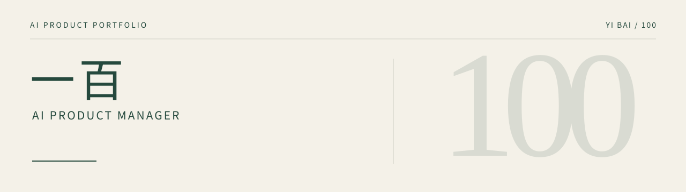
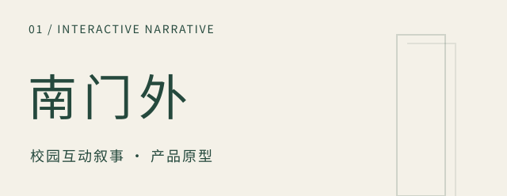
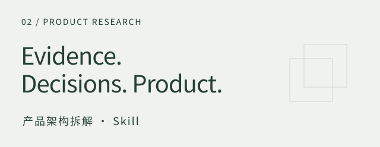

<picture>
  <source media="(prefers-color-scheme: dark)" srcset="assets/profile-header-dark.svg">
  <source media="(prefers-color-scheme: light)" srcset="assets/profile-header-light.svg">
  
</picture>

 

你好，我是一百，一名 **AI 产品经理**。

这里记录我的产品原型、分析方法与交互探索。

## 精选作品

<table>
<tr>
<td width="50%" valign="top">
<a href="https://github.com/bankskurtzyulma843-hash/zhihu-life-book">
<picture>
  <source media="(prefers-color-scheme: dark)" srcset="assets/nanmenwai-dark.svg">
  
</picture>
</a>
<h3>让生成内容与确定性规则协作</h3>

一个经历大学四年的互动叙事原型，结合故事选择、人物关系、进度保存与手记回看。

<b>产品取舍</b> 模型可扩写当前故事；本地规则管理选择、状态和结果。在线扩写失败时，保留本地正文与当前选择。

当前为本地原型。在线接口已有模拟服务测试，真实模型调用待验证。

<a href="https://github.com/bankskurtzyulma843-hash/zhihu-life-book">查看项目与说明 ↗</a>

</td>
<td width="50%" valign="top">
<a href="https://github.com/bankskurtzyulma843-hash/-/tree/main/product-architecture-teardown">
<picture>
  <source media="(prefers-color-scheme: dark)" srcset="assets/research-dark.svg">
  
</picture>
</a>
<h3>把产品拆解整理成可复用流程</h3>

从用户、技术、模型和数据四个角度分析 AI 与软件产品，沿真实任务追踪输入、决策、执行与交付。

<b>分析方法</b> 区分已确认事实、合理推断与改进建议；把关键判断关联到证据，并关注异常、恢复和能力边界。

项目形态：产品分析工作流与报告交付规范。

<a href="https://github.com/bankskurtzyulma843-hash/-/tree/main/product-architecture-teardown">查看方法与流程 ↗</a>

</td>
</tr>
</table>

### 03　人生之书 · 大学篇

从星河聚成书本，到宿舍、课堂、朋友、实习与毕业，探索大学四年的情景叙事与选择体验。

**体验探索：** 书本开场、四年星图、情景选择、记忆记录与文本导出。

[在线体验 ↗](https://bankskurtzyulma843-hash.github.io/blueyard-galaxy/)　·　[项目说明 ↗](https://github.com/bankskurtzyulma843-hash/blueyard-galaxy)

基于 BlueYard 原有粒子场景与交互引擎扩展叙事层。原始设计和实现来自 Unseen Studio，素材与改编说明见项目文档。

 

---

  一百 / AI PRODUCT MANAGER 
  产品原型 · 分析方法 · 交互探索

